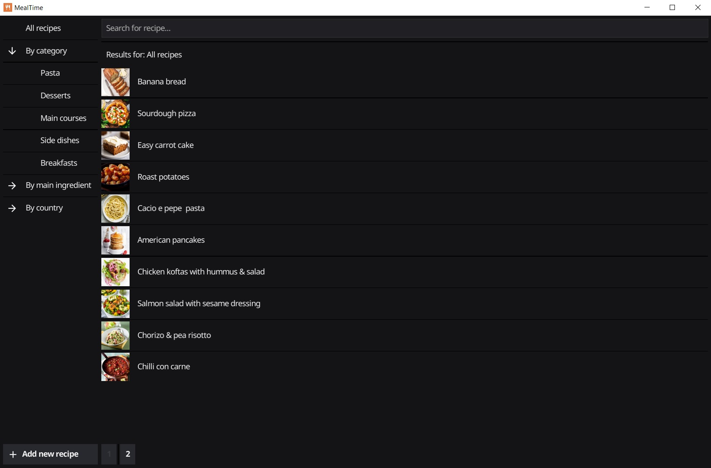
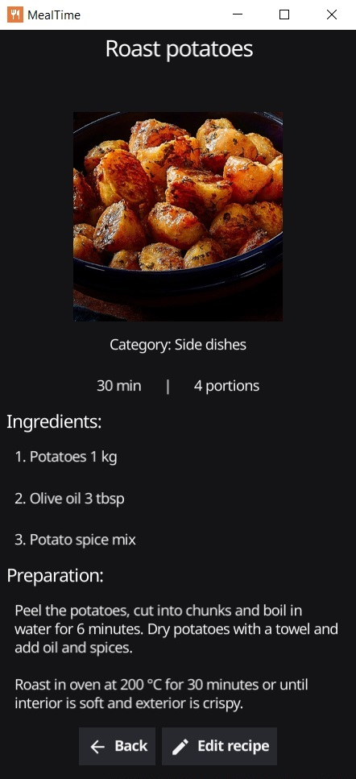

# MealTime

MealTime is a cross-platform app for organizing your cooking recipes. 

Save your favourite recipes and organize them by category, main ingredient or country.

The app uses a cloud-hosted MongoDB database, which allows synchronisation across multiple devices.

# Screenshots


&nbsp;


# Building for Windows/Linux

1. Install requirements:

```bash
go get
```

2. Package the application
```bash
fyne package -os {windows / linux} -icon resources/icon.png
```
This will create an executable file in app directory.


# Building for Android
1. Install requirements:

```bash
go get
```
2. Install [Android NDK](https://developer.android.com/ndk). 

3. Open file `envVars.cmd` and set the environment variable ANDROID_NDK_HOME to the installation directory of Android NDK (usually `...\Android\Sdk\ndk\{version}`). This step might not be necessary depending on your setup.

2. Package the application:
```bash
fyne package -os android -appID MealTime.app -icon resources/icon.png
```
This will create an APK file in app directory.

# Database configuration

To use the app, you will have to configure a few things in MongoDB.

1. Create a new MongoDB Atlas cluster - M0 (free tier) will suffice. Create a new database and collection for your recipes.
2. In Atlas App Services, create a new app and link it to your database.
3. Select your app and in Data Access/Authentication menu choose Email/Password.
4. Add a new app user.

You will input these credentials in your app the first time you log in. This allows for all instances of the app to have up-to-date information and to securely access your database. 

# Built With
- [Golang](https://go.dev/)
- [Fyne](https://fyne.io/) - GUI framework
- [MongoDB](https://www.mongodb.com/) - Database

# License
This project is licensed under the MIT license - see the LICENSE file for details.